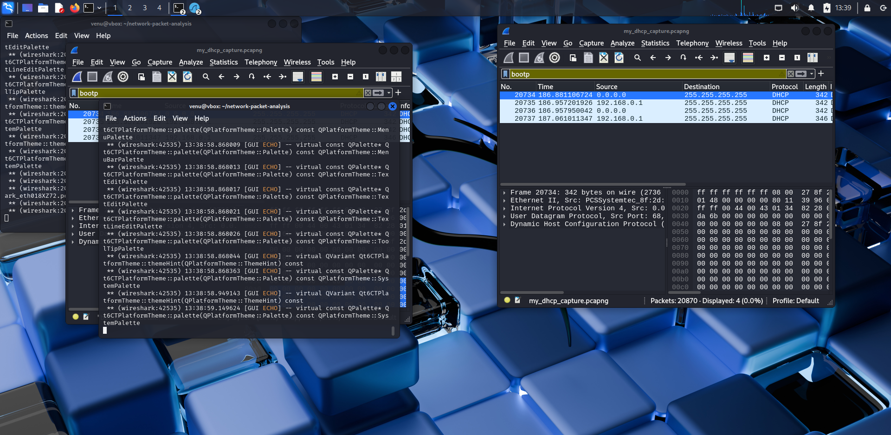

# Network Packet Analysis: DHCP DORA Workflow

This project contains analysis of the DHCP DORA (Discover, Offer, Request, Acknowledgment) process captured from a real network using Wireshark and reviewed using Snort.

## 📁 Files Included
- `my_dhcp_capture.pcapng` – Full network capture of DHCP handshake
- `dhcp_analysis.md` – Detailed walkthrough of the DHCP process
- `dhcp_packets.png` – Annotated screenshot of packet flow
- `.pcap` samples for testing/snort training

## 🛠 Tools Used
- Wireshark
- Snort 3
- Kali Linux (VirtualBox)

## 📌 Highlights
- Detected DORA handshake
- Extracted MAC and IP assignment
- Built a structured GitHub repo for packet analysis

---

## 📸 Screenshot Preview

---

## 🔒 Author
**Venu Madhav Katta**  
🎓 Master’s in Cybersecurity  
📧 venumadhavkatta0044@gmail.com
# network-packet-analysis
A project to analyze packet captures and detect network attacks using Wireshark and Snort.
